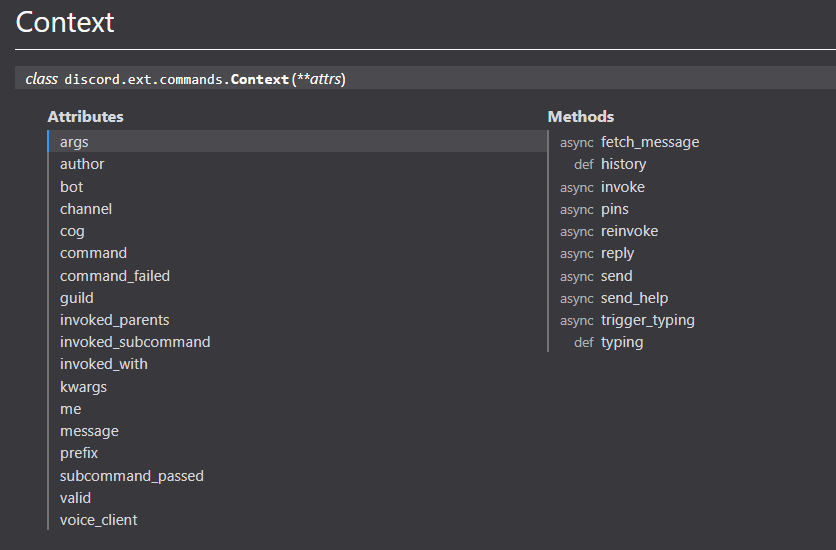

## Intro to discord.py
In this quick introduction you'll learn how to make a quick and simple discord bot with a few cool commands. To get started, you'll need to meet the requirements to be able to run the code

## Requirements
- [Python version 3.6+](https://www.python.org/downloads/release/python-367/)
- [discord.py](https://github.com/Rapptz/discord.py)
- An [IDE](https://code.visualstudio.com/)


## Quick way to make a bot

```python
from discord.ext import commands

#The bot prefix is what you type before entering the command
#Ex: !.play The sound silence original
#Ex: !.kick @BadMember
bot_prefix = "!."


#This will make it so that the bot has a prefix
bot = commands.Bot(command_prefix=bot_prefix)

@bot.event
async def on_ready():
    """
    This function will run when the bot is ready, the function must be called on_ready and nothing else if done with this method
    """
    #Print the bot's name when it's ready
    print(bot.user.name)


@bot.command()
async def hello(ctx,name=None):
    """
    - name
        - The name to say hello back to
        - the =None gives it a default value of None if no input is given
    """
    #This will say "Hello there $name" to the text channel where the command was used
    await ctx.send(f"Hello there, {name}")
    #Remember to use the keyword await before invoking the function if it's an async function


#Run the bot with the bot's token
bot.run("BOT_TOKEN_HERE")
```

You can check what attributes, methods the parameter ctx provides and do [here](https://discordpy.readthedocs.io/en/latest/ext/commands/api.html#context)  


Now if you test the command and typed `An dy` with a space it'll say `Hello there, An`.  
To fix this you need to add `,*,` before the name of the parameter for spaces to work.  
`async def hello(ctx,*,name)`, but doing this will default the value of `name` to be an empty string (`""`) even if there's no value given.


