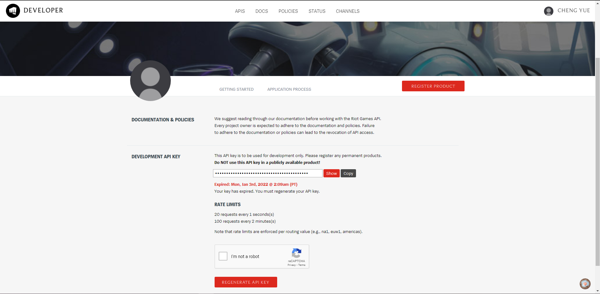

## Requests and League of Legends API
If yoy haven't already read the intro to request then read it [here](https://github.com/CharmingDays/learning_python/blob/main/examples/requests.md) because you'll need a basic understanding of how the `requests` and HTTP requests work

## Requirements
- [Python 3.6++](https://www.python.org/)
- Riot games [account](https://developer.riotgames.com/)
- [requests library](https://docs.python-requests.org/en/latest/user/quickstart/)
- An [IDE](https://code.visualstudio.com/)

Once you have the requirements head on to the Riot Games' developer page [here](https://developer.riotgames.com/) you'll need to then login with the account you created and register as a developer to get a API KEY

